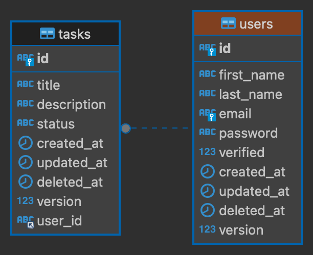
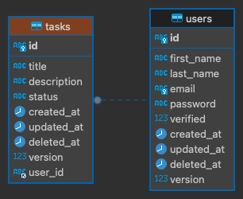

### Problem statement
<p>
Develop a RESTful API for a task management system, incorporating user authentication through JWT tokens to ensure secure access. Implement comprehensive CRUD operations to enable the creation, retrieval, updating, and deletion of tasks. Use a database of your choice for reliable data persistence. Additionally, validate input data to maintain data integrity and security throughout the system.
</p>

### Features
- User Authentication: `/src/modules/auth`
  - Using JWT tokens for user authentication.
- Task CRUD Operations: `/src/modules/task`
	- Create
	- Get One
	- Get All
	- Update
	- Delete One
	- Delete All
	 
	
- Data Persistence: `/src/database`
    - App supports `MySQL` & `SQLite` databases - SQLite is default for quickstart.
    
- Input Validation: `/src/**/*.dto.ts`
    - Using npm `Class validator` and DTO pattern for input payload validation.

### Instructions
Document the following:
- API endpoints.
- Data models.
- Provide clear and concise documentation to aid future developers who may work with your code.
- Any other relevant information necessary for understanding and using your code.
- Make sure to create a socket to stream the data created In real-time.
- Use GitHub to manage your code.
- Share the repository URL along with any necessary documentation or instructions for running the code through the email thread on Factorial.
- Please complete the following tasks within 5 days.

## Download a copy

```bash
$ git clone https://github.com/godsgiftuko/task_management_system.git
```

## Installation

```bash
$ npm install
```

## Running the app

```bash
# development
$ npm run start

# watch mode
$ npm run start:dev

# production mode
$ npm run start:prod
```

### Note:
Please, make sure to add `.env` file in the root dir. Provide neccessary env variables into the file to kick start the app.
<a style="text-decoration: underline" href="https://github.com/godsgiftuko/task_management_system/blob/main/.env.example" target="blank"> Check out the .env.example
</a> file.

## Database setup
In order to use MySQL DB, set `USE_SQLITE=false` in .env and as well the  database variables.
```bash
//.env
DATABASE_USER=""
DATABASE_PASSWORD=""
DATABASE_HOST=""
DATABASE_PORT=""
DATABASE_NAME=""
```
### Migrations
```bash
# run database migration
$ npm run migration:run

# generate migration file
$ npm run migration:generate --name=[file_name]

# revert database migration
$ npm run migration:revert
```

### Note:
Please, note that anytime you make changes to a `table` in this case an `entity` file, always follow up with the steps below:

- npm run migration:generate --name=[file_name]
- npm run migration:run

In situations where you need to reverse the previous migration run `npm run migration:revert` CMD.


## API Documentation

<p align="center">
  <a style="text-decoration: underline" href="https://documenter.getpostman.com/view/8901262/2sA3JT3yDG" target="blank">See documentation</a>
</p>

## Data models
- User ER diagram


- Task ER diagram

